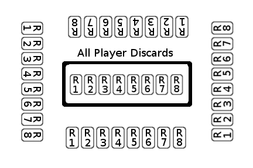

# Time Machine card game

Time Machine is a card game supporting two or more players.  Each player should have their own 40-card deck, available for purchase at [DriveThruCards](http://www.drivethrurpg.com/product/229995/Time-Machine).

Some images were taken and modified from [openclipart](https://openclipart.org/share).  All of these are used with permission through the Creative Commons Zero 1.0 Public Domain License.

This README is the official documentation, available on [GitHub](https://github.com/couthcommander/tmgame).

## Detailed Game Instructions

Each game is made up of eight rounds.  The goal is to complete a time machine.

If you have any questions or comments, please create an [issue](https://github.com/couthcommander/tmgame/issues).

## Example Layout

The following is an example layout for a four-player game.  Each player should have room for eight stacks of cards, one for each round.  There should also be room for a shared discard pile in the middle of the table.

### Game Preperation

Each player should shuffle his deck of 40 cards.  There are four types of cards:

* finance (8)
* fuel (10)
* research (10)
* parts (12)

Every card is numbered. As there are eight finance cards, the finance cards will be numbered one to eight.

### Rounds 1 - 4

Each player should deal five cards from his deck into his hand.

Each round has three turns.  For a given turn the player will play one card from his hand face down.  He should then pass the remaining cards in his hand to the left.

* Thus for turn one, the player will have a choice of five cards.
* For turn two, the player will have a choice of four cards.
* For turn three, the player will have a choice of three cards.

After the three turns, each player should put the two remaining cards into the shared discard pile for the given round.

### After Round 4

Once round four is completed, each player should have played twelve cards.  It just so happens that it takes twelve cards to complete a time machine.  Thus a time machine cannot be completed before round five.

In order to build a time machine, you need the following components:

* finance (2)
* fuel (3)
* research (3)
* parts (4)

This is notated on each card by the number of stars.

### Rounds 5 - 8

Before the play phase a player may activate his time machine.  Activated time machines can perform one action.  After all actions the play phase begins.

### Time Machine Activation

At the beginning of a round, you may activate your time machine by displaying the necessary components.  This should be done before the first turn.  You may also choose to not activate your time machine.  Once activated a time machine stays activated unless it is destroyed.

Display the necessary components by turning cards face up.  You must have all of the necessary components and they must come from previous rounds -- you cannot include your current hand.

If you have more components than necessary, you do not have to turn the extra cards over.

For example, assume you have played the following cards:

* round 1: parts(1), fuel(1), research(1)
* round 2: parts(2), fuel(2), research(2)
* round 3: parts(3), fuel(3), research(3)
* round 4: parts(4), fuel(4), finance(1)
* round 5: parts(5), finance(2), research(4)

You may activate your time machine at the start of round six.  As you have extra parts, fuel, and research, you can choose which to reveal.  As you do not have extra finance, you will need to reveal both finance cards.

### Time Machine Actions

Before the play phase of a round, a time machine can perform at most one of three actions:

* destroy all cards from one type of component for a given round
* retrieve one card from a past round's discard pile
* move one card from the current hand into a future round's play area

Each action costs one fuel.  The used fuel should be removed from the game - it should not be placed in the discard pile.

Destroying cards from a previous round may destroy players' time machines, as a player may no longer have all of the necessary components.  This will take effect during the next round.

Once a time machine is revealed, the fuel requirement is reduced from three to one.  If a player has no fuel, the time machine is destroyed.

Multiple players may choose to perform an action with their activated time machine.  Order of play is determined by the player with the highest numbered fuel card.  The player going first must use this card as his fuel action (so it is removed from play).  Player order should go clockwise after the first player, and they may choose which fuel to use.  If there is a tie on the highest numbered fuel card, look at the second highest, then third highest to break the tie.  However only the highest numbered card will be used for the action.

### After Round 8

After eight rounds the winner is the player with a complete time machine.  Ties are broken by the player with the most finance; then fuel; then research; then parts.
